# ZetMQ — Documentacao de Arquitetura

## 1. Visao Geral

O **ZetMQ** e um broker de mensagens orientado a subjects, escrito em Rust, inspirado no NATS.io. A arquitetura e single-node, in-memory, assincrona e projetada para alto throughput e baixa latencia.

O sistema e organizado em 6 crates com dependencias unidirecionais:

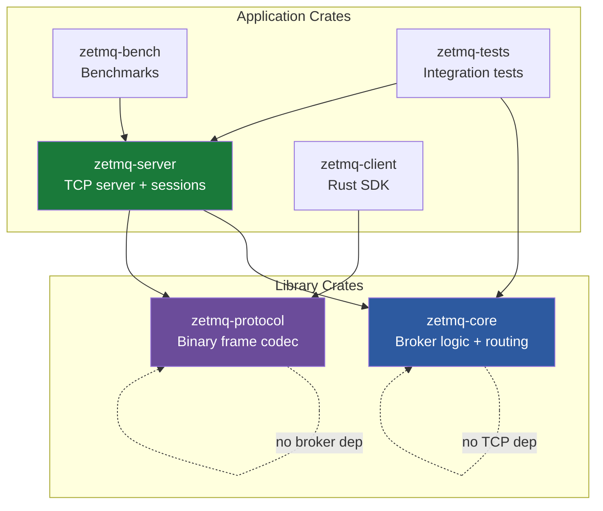
```mermaid
graph TB
    subgraph "Application Crates"
        SERVER["zetmq-server<br/>TCP server + sessions"]
        CLIENT["zetmq-client<br/>Rust SDK"]
        BENCH["zetmq-bench<br/>Benchmarks"]
        TESTS["zetmq-tests<br/>Integration tests"]
    end

    subgraph "Library Crates"
        CORE["zetmq-core<br/>Broker logic + routing"]
        PROTO["zetmq-protocol<br/>Binary frame codec"]
    end

    SERVER --> CORE
    SERVER --> PROTO
    CLIENT --> PROTO
    TESTS --> CORE
    TESTS --> SERVER
    BENCH --> SERVER

    CORE -.->|"no TCP dep"| CORE
    PROTO -.->|"no broker dep"| PROTO

    style CORE fill:#2d5aa0,color:#fff
    style PROTO fill:#6b4c9a,color:#fff
    style SERVER fill:#1a7a3a,color:#fff
```

### Principios

| Principio | Descricao |
|-----------|-----------|
| Core independente de transporte | `zetmq-core` nao depende de TCP/Tokio network |
| Protocolo independente do dominio | `zetmq-protocol` nao conhece o broker |
| Evolucao incremental | MVP in-memory first, cluster e persistencia depois |
| Performance mensuravel | Toda otimizacao validada com benchmarks |

---

## 2. Arquitetura de Componentes

### 2.1 Visao Geral dos Componentes

```mermaid
graph TB
    CLIENT_EXT["Client Application"]

    subgraph "zetmq-server"
        LISTENER["TcpListener<br/>Accept Loop"]
        SESSION["Session Handler<br/>Read/Write Loops"]
        DISPATCHER["Command Dispatcher"]
        CONFIG["ServerConfig<br/>port=4222<br/>output_buffer=65536<br/>max_frame=2MB"]
    end

    subgraph "zetmq-core"
        BROKER["BrokerCore<br/>Arc-shared"]
        REGISTRY["SubscriptionRegistry<br/>DashMap&lt;SubId, Subscription&gt;"]
        ROUTER["RoutingEngine"]
        METRICS["CoreMetrics<br/>AtomicU64 counters"]
        ID_GEN["IdGenerator<br/>AtomicU64"]
        SUBJECT_CACHE["SubjectCache<br/>DashMap&lt;String, Subject&gt;"]
        QG["QueueGroupState<br/>members + round-robin index"]
    end

    subgraph "Routing Internals"
        EXACT["Exact Match<br/>DashMap&lt;String, Vec&lt;SubId&gt;&gt;"]
        TRIE["SubjectTrie<br/>RwLock + HashMap tree"]
        WILDCARD_FLAG["has_wildcards<br/>AtomicBool fast-path"]
    end

    subgraph "Per-Connection"
        READ_LOOP["Read Loop<br/>BufReader → BytesMut"]
        WRITE_LOOP["Write Loop<br/>BytesMut encode buffer"]
        OUTBOUND["mpsc Channel<br/>OutboundFrame"]
        STATE["SessionState<br/>New | Connected | Draining | Closed"]
    end

    CLIENT_EXT -->|"TCP + ZetMQ Protocol"| LISTENER
    LISTENER -->|"TcpStream"| SESSION
    SESSION --> READ_LOOP
    SESSION --> WRITE_LOOP
    READ_LOOP -->|"Frame"| DISPATCHER
    DISPATCHER -->|"BrokerCommand"| BROKER
    BROKER --> REGISTRY
    BROKER --> ROUTER
    BROKER --> METRICS
    BROKER --> SUBJECT_CACHE
    BROKER --> QG
    ROUTER --> EXACT
    ROUTER --> TRIE
    ROUTER --> WILDCARD_FLAG
    REGISTRY -->|"delivery: Arc&lt;dyn DeliveryHandle&gt;"| OUTBOUND
    WRITE_LOOP <--|"recv OutboundFrame"| OUTBOUND

    style BROKER fill:#2d5aa0,color:#fff
    style ROUTER fill:#6b4c9a,color:#fff
    style SESSION fill:#1a7a3a,color:#fff
```

### 2.2 BrokerCore — Estado Interno

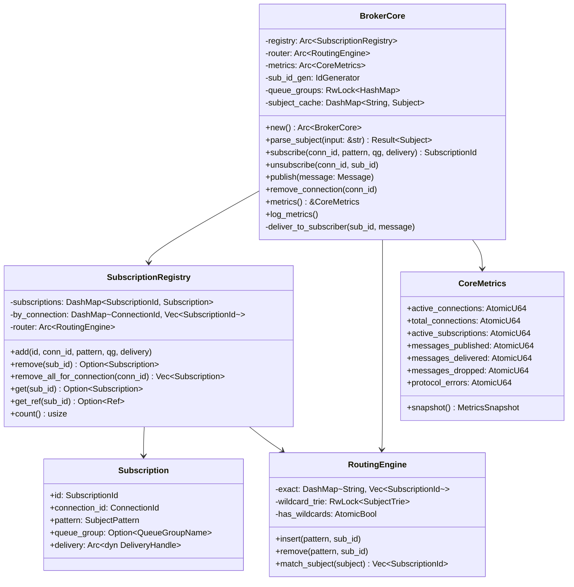
```mermaid
classDiagram
    class BrokerCore {
        -registry: Arc~SubscriptionRegistry~
        -router: Arc~RoutingEngine~
        -metrics: Arc~CoreMetrics~
        -sub_id_gen: IdGenerator
        -queue_groups: RwLock~HashMap~
        -subject_cache: DashMap~String, Subject~
        +new() Arc~BrokerCore~
        +parse_subject(input: &str) Result~Subject~
        +subscribe(conn_id, pattern, qg, delivery) SubscriptionId
        +unsubscribe(conn_id, sub_id)
        +publish(message: Message)
        +remove_connection(conn_id)
        +metrics() &CoreMetrics
        +log_metrics()
        -deliver_to_subscriber(sub_id, message)
    }

    class SubscriptionRegistry {
        -subscriptions: DashMap~SubscriptionId, Subscription~
        -by_connection: DashMap~ConnectionId, Vec~SubscriptionId~~
        -router: Arc~RoutingEngine~
        +add(id, conn_id, pattern, qg, delivery)
        +remove(sub_id) Option~Subscription~
        +remove_all_for_connection(conn_id) Vec~Subscription~
        +get(sub_id) Option~Subscription~
        +get_ref(sub_id) Option~Ref~
        +count() usize
    }

    class RoutingEngine {
        -exact: DashMap~String, Vec~SubscriptionId~~
        -wildcard_trie: RwLock~SubjectTrie~
        -has_wildcards: AtomicBool
        +insert(pattern, sub_id)
        +remove(pattern, sub_id)
        +match_subject(subject) Vec~SubscriptionId~
    }

    class Subscription {
        +id: SubscriptionId
        +connection_id: ConnectionId
        +pattern: SubjectPattern
        +queue_group: Option~QueueGroupName~
        +delivery: Arc~dyn DeliveryHandle~
    }

    class CoreMetrics {
        +active_connections: AtomicU64
        +total_connections: AtomicU64
        +active_subscriptions: AtomicU64
        +messages_published: AtomicU64
        +messages_delivered: AtomicU64
        +messages_dropped: AtomicU64
        +protocol_errors: AtomicU64
        +snapshot() MetricsSnapshot
    }

    BrokerCore --> SubscriptionRegistry
    BrokerCore --> RoutingEngine
    BrokerCore --> CoreMetrics
    SubscriptionRegistry --> Subscription
    SubscriptionRegistry --> RoutingEngine
```

---

## 3. Modelo de Protocolo

### 3.1 Frame Format

Todos os frames seguem o mesmo formato binario. O header tem tamanho fixo de 22 bytes.

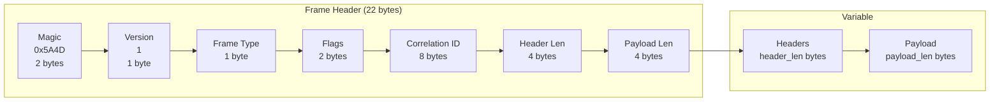
```mermaid
graph LR
    subgraph "Frame Header (22 bytes)"
        M["Magic<br/>0x5A4D<br/>2 bytes"]
        V["Version<br/>1<br/>1 byte"]
        FT["Frame Type<br/>1 byte"]
        FL["Flags<br/>2 bytes"]
        CID["Correlation ID<br/>8 bytes"]
        HL["Header Len<br/>4 bytes"]
        PL["Payload Len<br/>4 bytes"]
    end

    subgraph "Variable"
        HDR["Headers<br/>header_len bytes"]
        PAY["Payload<br/>payload_len bytes"]
    end

    M --> V --> FT --> FL --> CID --> HL --> PL --> HDR --> PAY
```

### 3.2 Tipos de Frame

| Frame Type | Codigo | Direcao | Descricao |
|------------|--------|---------|-----------|
| CONNECT | 0x01 | Client → Server | Inicio de conexao |
| CONNACK | 0x02 | Server → Client | Confirmacao de conexao |
| PING | 0x10 | Client → Server | Keepalive |
| PONG | 0x11 | Server → Client | Resposta ao PING |
| PUB | 0x20 | Client → Server | Publicar mensagem |
| MSG | 0x21 | Server → Client | Entrega de mensagem |
| SUB | 0x30 | Client → Server | Criar subscription |
| SUBACK | 0x31 | Server → Client | Confirmacao de subscription |
| UNSUB | 0x32 | Client → Server | Remover subscription |
| UNSUBACK | 0x33 | Server → Client | Confirmacao de unsub |
| ERROR | 0xE0 | Server → Client | Erro de protocolo |

### 3.3 Payload Formats

**PUB Payload:**
```
+--------------+----------+---------------+--------+-----------+
| subject_len  | subject  | reply_len     | reply  | data      |
| 2 bytes BE   | variable | 2 bytes BE    | var    | variable  |
+--------------+----------+---------------+--------+-----------+
```

**SUB Payload:**
```
+--------------+------------------+------------+--------------+
| pattern_len  | subject_pattern  | qg_len     | queue_group  |
| 1 byte       | variable         | 1 byte     | variable     |
+--------------+------------------+------------+--------------+
```

**MSG Payload (server → client):**
```
+--------------+----------+---------------+--------+----------+-----------+
| subject_len  | subject  | reply_len     | reply  | sub_id   | data      |
| 2 bytes BE   | variable | 2 bytes BE    | var    | 8 bytes  | variable  |
+--------------+----------+---------------+--------+----------+-----------+
```

**SUBACK / UNSUBACK Payload:**
```
+------------------+
| subscription_id  |
| 8 bytes BE       |
+------------------+
```

---

## 4. Diagramas de Sequencia

### 4.1 Estabelecimento de Conexao

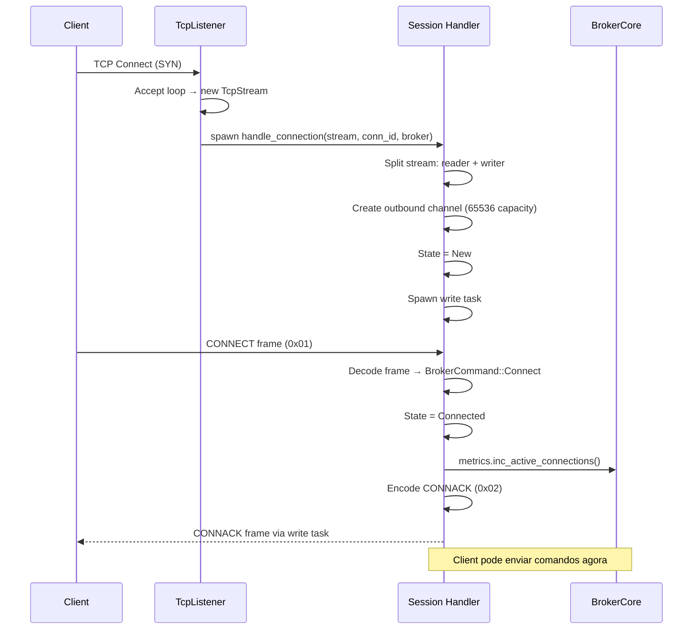
```mermaid
sequenceDiagram
    participant C as Client
    participant L as TcpListener
    participant S as Session Handler
    participant B as BrokerCore

    C->>L: TCP Connect (SYN)
    L->>L: Accept loop → new TcpStream
    L->>S: spawn handle_connection(stream, conn_id, broker)
    S->>S: Split stream: reader + writer
    S->>S: Create outbound channel (65536 capacity)
    S->>S: State = New
    S->>S: Spawn write task

    C->>S: CONNECT frame (0x01)
    S->>S: Decode frame → BrokerCommand::Connect
    S->>S: State = Connected
    S->>B: metrics.inc_active_connections()
    S->>S: Encode CONNACK (0x02)
    S-->>C: CONNACK frame via write task

    Note over S,B: Client pode enviar comandos agora
```

### 4.2 Subscribe

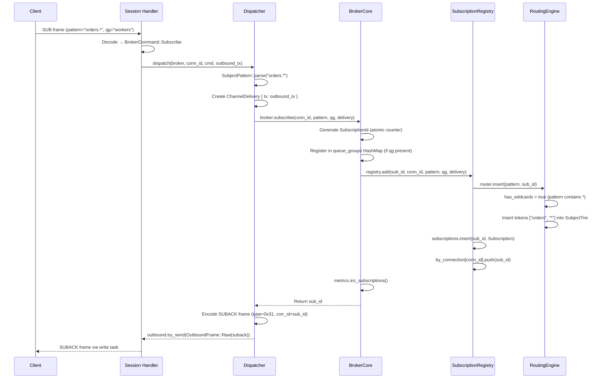
```mermaid
sequenceDiagram
    participant C as Client
    participant S as Session Handler
    participant D as Dispatcher
    participant B as BrokerCore
    participant R as SubscriptionRegistry
    participant RT as RoutingEngine

    C->>S: SUB frame (pattern="orders.*", qg="workers")
    S->>S: Decode → BrokerCommand::Subscribe
    S->>D: dispatch(broker, conn_id, cmd, outbound_tx)

    D->>D: SubjectPattern::parse("orders.*")
    D->>D: Create ChannelDelivery { tx: outbound_tx }
    D->>B: broker.subscribe(conn_id, pattern, qg, delivery)

    B->>B: Generate SubscriptionId (atomic counter)
    B->>B: Register in queue_groups HashMap (if qg present)
    B->>R: registry.add(sub_id, conn_id, pattern, qg, delivery)
    R->>RT: router.insert(pattern, sub_id)
    RT->>RT: has_wildcards = true (pattern contains *)
    RT->>RT: Insert tokens ["orders", "*"] into SubjectTrie
    R->>R: subscriptions.insert(sub_id, Subscription)
    R->>R: by_connection[conn_id].push(sub_id)
    B->>B: metrics.inc_subscriptions()

    B-->>D: Return sub_id
    D->>D: Encode SUBACK frame (type=0x31, corr_id=sub_id)
    D-->>S: outbound.try_send(OutboundFrame::Raw(suback))
    S-->>C: SUBACK frame via write task
```

### 4.3 Publish — Fanout (sem Queue Group)

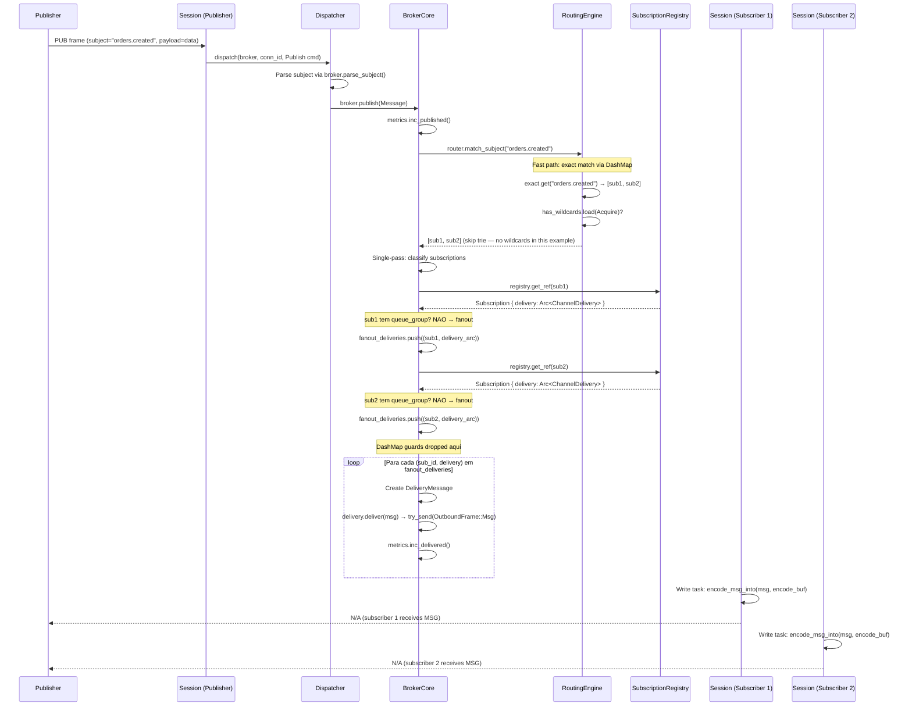
```mermaid
sequenceDiagram
    participant P as Publisher
    participant S as Session (Publisher)
    participant D as Dispatcher
    participant B as BrokerCore
    participant RT as RoutingEngine
    participant R as SubscriptionRegistry
    participant S1 as Session (Subscriber 1)
    participant S2 as Session (Subscriber 2)

    P->>S: PUB frame (subject="orders.created", payload=data)
    S->>D: dispatch(broker, conn_id, Publish cmd)
    D->>D: Parse subject via broker.parse_subject()
    D->>B: broker.publish(Message)

    B->>B: metrics.inc_published()
    B->>RT: router.match_subject("orders.created")

    Note over RT: Fast path: exact match via DashMap
    RT->>RT: exact.get("orders.created") → [sub1, sub2]
    RT->>RT: has_wildcards.load(Acquire)?
    RT-->>B: [sub1, sub2] (skip trie — no wildcards in this example)

    B->>B: Single-pass: classify subscriptions
    B->>R: registry.get_ref(sub1)
    R-->>B: Subscription { delivery: Arc<ChannelDelivery> }
    Note over B: sub1 tem queue_group? NAO → fanout
    B->>B: fanout_deliveries.push((sub1, delivery_arc))

    B->>R: registry.get_ref(sub2)
    R-->>B: Subscription { delivery: Arc<ChannelDelivery> }
    Note over B: sub2 tem queue_group? NAO → fanout
    B->>B: fanout_deliveries.push((sub2, delivery_arc))

    Note over B: DashMap guards dropped aqui

    loop Para cada (sub_id, delivery) em fanout_deliveries
        B->>B: Create DeliveryMessage
        B->>B: delivery.deliver(msg) → try_send(OutboundFrame::Msg)
        B->>B: metrics.inc_delivered()
    end

    S1->>S1: Write task: encode_msg_into(msg, encode_buf)
    S1-->>P: N/A (subscriber 1 receives MSG)

    S2->>S2: Write task: encode_msg_into(msg, encode_buf)
    S2-->>P: N/A (subscriber 2 receives MSG)
```

### 4.4 Publish — Fanout + Wildcard

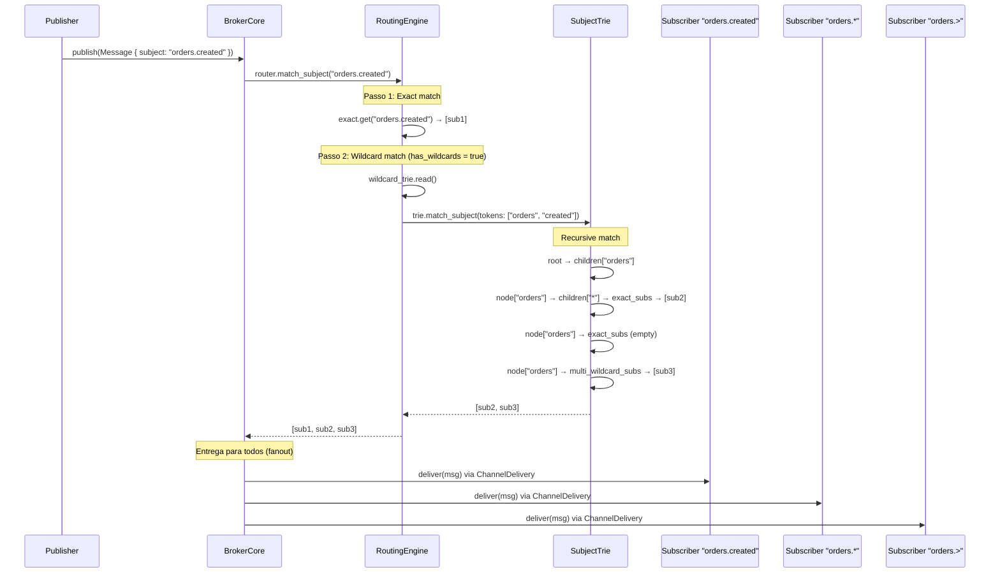
```mermaid
sequenceDiagram
    participant P as Publisher
    participant B as BrokerCore
    participant RT as RoutingEngine
    participant TRIE as SubjectTrie
    participant S1 as Subscriber "orders.created"
    participant S2 as Subscriber "orders.*"
    participant S3 as Subscriber "orders.>"

    P->>B: publish(Message { subject: "orders.created" })
    B->>RT: router.match_subject("orders.created")

    Note over RT: Passo 1: Exact match
    RT->>RT: exact.get("orders.created") → [sub1]

    Note over RT: Passo 2: Wildcard match (has_wildcards = true)
    RT->>RT: wildcard_trie.read()
    RT->>TRIE: trie.match_subject(tokens: ["orders", "created"])

    Note over TRIE: Recursive match
    TRIE->>TRIE: root → children["orders"]
    TRIE->>TRIE: node["orders"] → children["*"] → exact_subs → [sub2]
    TRIE->>TRIE: node["orders"] → exact_subs (empty)
    TRIE->>TRIE: node["orders"] → multi_wildcard_subs → [sub3]

    TRIE-->>RT: [sub2, sub3]
    RT-->>B: [sub1, sub2, sub3]

    Note over B: Entrega para todos (fanout)
    B->>S1: deliver(msg) via ChannelDelivery
    B->>S2: deliver(msg) via ChannelDelivery
    B->>S3: deliver(msg) via ChannelDelivery
```

### 4.5 Publish — Queue Group (Round-Robin)

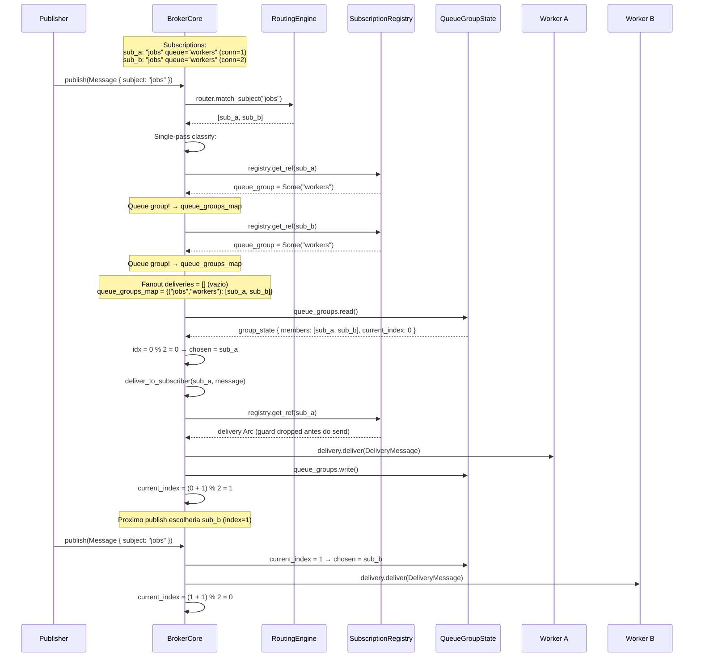
```mermaid
sequenceDiagram
    participant P as Publisher
    participant B as BrokerCore
    participant RT as RoutingEngine
    participant R as SubscriptionRegistry
    participant QG as QueueGroupState
    participant WA as Worker A
    participant WB as Worker B

    Note over B: Subscriptions:<br/>sub_a: "jobs" queue="workers" (conn=1)<br/>sub_b: "jobs" queue="workers" (conn=2)

    P->>B: publish(Message { subject: "jobs" })
    B->>RT: router.match_subject("jobs")
    RT-->>B: [sub_a, sub_b]

    B->>B: Single-pass classify:
    B->>R: registry.get_ref(sub_a)
    R-->>B: queue_group = Some("workers")
    Note over B: Queue group! → queue_groups_map

    B->>R: registry.get_ref(sub_b)
    R-->>B: queue_group = Some("workers")
    Note over B: Queue group! → queue_groups_map

    Note over B: Fanout deliveries = [] (vazio)<br/>queue_groups_map = {("jobs","workers"): [sub_a, sub_b]}

    B->>QG: queue_groups.read()
    QG-->>B: group_state { members: [sub_a, sub_b], current_index: 0 }
    B->>B: idx = 0 % 2 = 0 → chosen = sub_a
    B->>B: deliver_to_subscriber(sub_a, message)
    B->>R: registry.get_ref(sub_a)
    R-->>B: delivery Arc (guard dropped antes do send)
    B->>WA: delivery.deliver(DeliveryMessage)

    B->>QG: queue_groups.write()
    B->>B: current_index = (0 + 1) % 2 = 1

    Note over B: Proximo publish escolheria sub_b (index=1)

    P->>B: publish(Message { subject: "jobs" }) #2
    B->>QG: current_index = 1 → chosen = sub_b
    B->>WB: delivery.deliver(DeliveryMessage)
    B->>B: current_index = (1 + 1) % 2 = 0
```

### 4.6 Unsubscribe

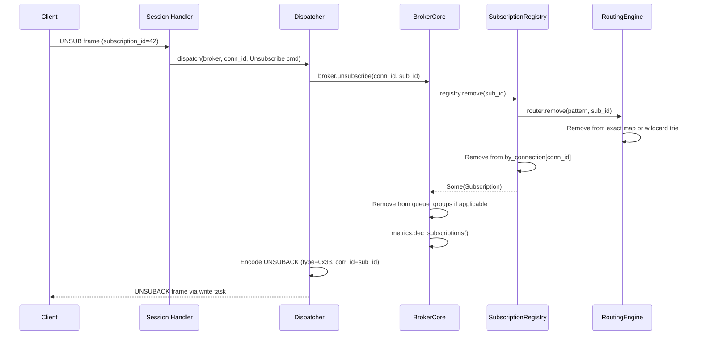
```mermaid
sequenceDiagram
    participant C as Client
    participant S as Session Handler
    participant D as Dispatcher
    participant B as BrokerCore
    participant R as SubscriptionRegistry
    participant RT as RoutingEngine

    C->>S: UNSUB frame (subscription_id=42)
    S->>D: dispatch(broker, conn_id, Unsubscribe cmd)

    D->>B: broker.unsubscribe(conn_id, sub_id)
    B->>R: registry.remove(sub_id)
    R->>RT: router.remove(pattern, sub_id)
    RT->>RT: Remove from exact map or wildcard trie
    R->>R: Remove from by_connection[conn_id]
    R-->>B: Some(Subscription)
    B->>B: Remove from queue_groups if applicable
    B->>B: metrics.dec_subscriptions()

    D->>D: Encode UNSUBACK (type=0x33, corr_id=sub_id)
    D-->>C: UNSUBACK frame via write task
```

### 4.7 Disconnect

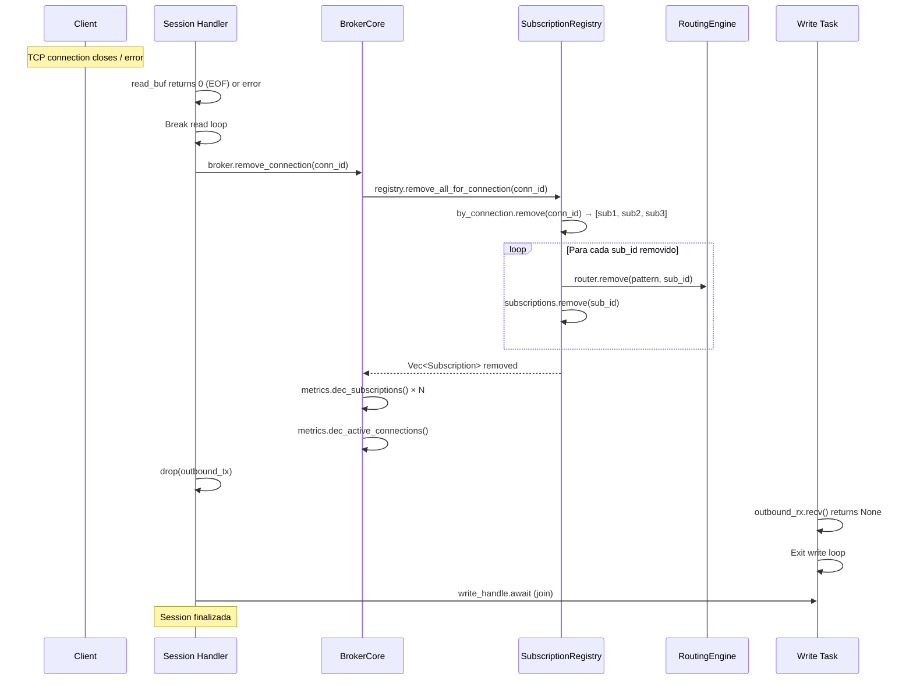
```mermaid
sequenceDiagram
    participant C as Client
    participant S as Session Handler
    participant B as BrokerCore
    participant R as SubscriptionRegistry
    participant RT as RoutingEngine
    participant WT as Write Task

    Note over C: TCP connection closes / error

    S->>S: read_buf returns 0 (EOF) or error
    S->>S: Break read loop

    S->>B: broker.remove_connection(conn_id)
    B->>R: registry.remove_all_for_connection(conn_id)
    R->>R: by_connection.remove(conn_id) → [sub1, sub2, sub3]
    loop Para cada sub_id removido
        R->>RT: router.remove(pattern, sub_id)
        R->>R: subscriptions.remove(sub_id)
    end
    R-->>B: Vec<Subscription> removed
    B->>B: metrics.dec_subscriptions() × N
    B->>B: metrics.dec_active_connections()

    S->>S: drop(outbound_tx)
    WT->>WT: outbound_rx.recv() returns None
    WT->>WT: Exit write loop
    S->>WT: write_handle.await (join)

    Note over S: Session finalizada
```

---

## 5. Modelo de Roteamento

### 5.1 RoutingEngine — Arquitetura Dual

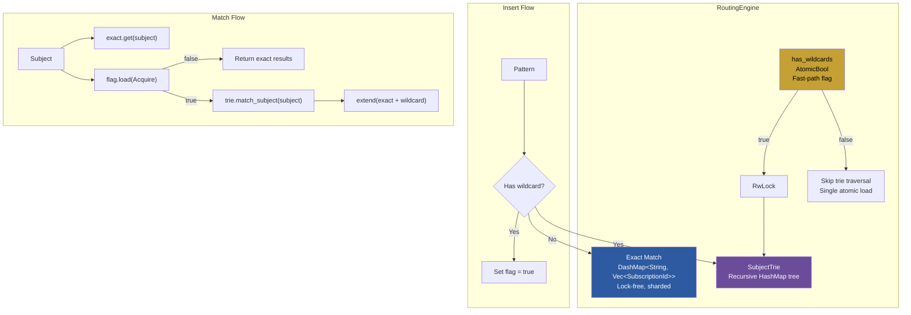
```mermaid
graph TB
    subgraph "RoutingEngine"
        direction TB
        EXACT["Exact Match<br/>DashMap&lt;String, Vec&lt;SubscriptionId&gt;&gt;<br/>Lock-free, sharded"]
        FLAG["has_wildcards<br/>AtomicBool<br/>Fast-path flag"]
        TRIE_LOCK["RwLock"]
        TRIE["SubjectTrie<br/>Recursive HashMap tree"]

        FLAG -->|"false"| SKIP["Skip trie traversal<br/>Single atomic load"]
        FLAG -->|"true"| TRIE_LOCK
        TRIE_LOCK --> TRIE
    end

    subgraph "Insert Flow"
        direction LR
        PAT["Pattern"] --> HAS_WC{"Has wildcard?"}
        HAS_WC -->|"No"| EXACT
        HAS_WC -->|"Yes"| TRIE
        HAS_WC -->|"Yes"| FLAG_SET["Set flag = true"]
    end

    subgraph "Match Flow"
        direction LR
        SUBJ["Subject"] --> EXACT_GET["exact.get(subject)"]
        SUBJ --> LOAD["flag.load(Acquire)"]
        LOAD -->|"false"| DONE["Return exact results"]
        LOAD -->|"true"| TRIE_MATCH["trie.match_subject(subject)"]
        TRIE_MATCH --> MERGE["extend(exact + wildcard)"]
    end

    style EXACT fill:#2d5aa0,color:#fff
    style TRIE fill:#6b4c9a,color:#fff
    style FLAG fill:#c4a035,color:#000
```

### 5.2 SubjectTrie — Estrutura

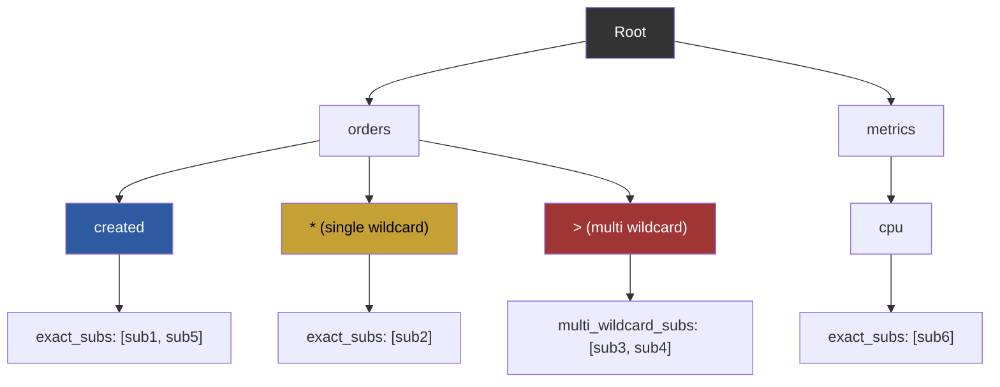
```mermaid
graph TB
    ROOT["Root"]

    ROOT --> ORDERS["orders"]
    ROOT --> METRICS["metrics"]

    ORDERS --> CREATED["created"]
    ORDERS --> STAR["* (single wildcard)"]
    ORDERS --> GT["> (multi wildcard)"]

    METRICS --> CPU["cpu"]

    CREATED --> CREATED_SUBS["exact_subs: [sub1, sub5]"]
    STAR --> STAR_SUBS["exact_subs: [sub2]"]
    GT --> GT_SUBS["multi_wildcard_subs: [sub3, sub4]"]
    CPU --> CPU_SUBS["exact_subs: [sub6]"]

    style ROOT fill:#333,color:#fff
    style CREATED fill:#2d5aa0,color:#fff
    style STAR fill:#c4a035,color:#000
    style GT fill:#a03535,color:#fff
```

**Matching para `orders.created`:**
1. `exact.get("orders.created")` → `[sub1, sub5]`
2. Trie traversal: `root → orders → *` (exact_subs: `[sub2]`) + `orders >` (multi_wildcard_subs: `[sub3, sub4]`)
3. Resultado: `[sub1, sub5, sub2, sub3, sub4]`

### 5.3 Regras de Subject

| Tipo | Pattern | Aceita wildcard | Exemplos de match |
|------|---------|----------------|-------------------|
| Literal | `orders.created` | Nao | `orders.created` |
| Single wildcard `*` | `orders.*` | Sim (subscribe only) | `orders.created`, `orders.cancelled` |
| Multi wildcard `>` | `orders.>` | Sim (subscribe only) | `orders.created`, `orders.a.b.c` |
| Publicacao | qualquer | Nao (rejeitado) | — |

---

## 6. Modelo de Concorrencia

### 6.1 Runtime e Tasks

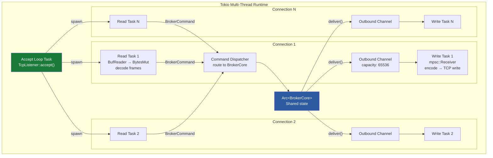
```mermaid
graph TB
    subgraph "Tokio Multi-Thread Runtime"
        ACCEPT["Accept Loop Task<br/>TcpListener::accept()"]

        subgraph "Connection 1"
            R1["Read Task 1<br/>BufReader → BytesMut<br/>decode frames"]
            W1["Write Task 1<br/>mpsc::Receiver<br/>encode → TCP write"]
            CH1["Outbound Channel<br/>capacity: 65536"]
            R1 -->|"BrokerCommand"| DISPATCH
            CH1 --> W1
        end

        subgraph "Connection 2"
            R2["Read Task 2"]
            W2["Write Task 2"]
            CH2["Outbound Channel"]
            R2 -->|"BrokerCommand"| DISPATCH
            CH2 --> W2
        end

        subgraph "Connection N"
            RN["Read Task N"]
            WN["Write Task N"]
            CHN["Outbound Channel"]
            RN -->|"BrokerCommand"| DISPATCH
            CHN --> WN
        end

        ACCEPT -->|"spawn"| R1
        ACCEPT -->|"spawn"| R2
        ACCEPT -->|"spawn"| RN

        DISPATCH["Command Dispatcher<br/>route to BrokerCore"]

        BROKER["Arc&lt;BrokerCore&gt;<br/>Shared state"]

        DISPATCH --> BROKER
        BROKER -->|"deliver()"| CH1
        BROKER -->|"deliver()"| CH2
        BROKER -->|"deliver()"| CHN
    end

    style BROKER fill:#2d5aa0,color:#fff
    style ACCEPT fill:#1a7a3a,color:#fff
```

### 6.2 Estruturas de Sincronizacao

| Estrutura | Tipo | Uso |
|-----------|------|-----|
| `subscriptions` | `DashMap<SubId, Subscription>` | Registry principal, lock-free reads |
| `by_connection` | `DashMap<ConnId, Vec<SubId>>` | Mapa conn → subs para cleanup rapido |
| `exact` | `DashMap<String, Vec<SubId>>` | Roteamento exato, sharded |
| `wildcard_trie` | `RwLock<SubjectTrie>` | Trie com read/write exclusivo |
| `has_wildcards` | `AtomicBool` | Fast-path para skipar trie |
| `queue_groups` | `RwLock<HashMap<(String,String), QueueGroupState>>` | Round-robin state |
| `subject_cache` | `DashMap<String, Subject>` | Cache de subjects parseados |
| `outbound channel` | `mpsc::channel<OutboundFrame>` | Buffer de saida por conexao |
| `metrics` | `AtomicU64` × 7 | Contadores lock-free |

### 6.3 Politica de Lock: Guard Drop antes de I/O

O broker extrai os dados necessarios do DashMap, clona o `Arc<dyn DeliveryHandle>`, e solevanta o guard **antes** de fazer o channel send. Isso evita segurar o lock do shard durante I/O.

```
DashMap guard ativo → clone delivery Arc → drop guard → channel send
```

---

## 7. Camada de Sessao — Detalhes

### 7.1 OutboundFrame — Encoding Lazy

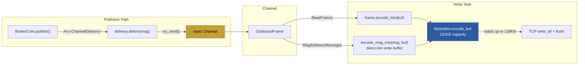
```mermaid
graph LR
    subgraph "Publisher Path"
        PUB["BrokerCore.publish()"]
        PUB -->|"Arc&lt;ChannelDelivery&gt;"| DELIVER["delivery.deliver(msg)"]
        DELIVER -->|"try_send()"| CH["mpsc Channel"]
    end

    subgraph "Channel"
        CH --> OUT["OutboundFrame"]
    end

    subgraph "Write Task"
        OUT -->|"Raw(Frame)"| ENCODE_RAW["frame.encode_into(buf)"]
        OUT -->|"Msg(DeliveryMessage)"| ENCODE_MSG["encode_msg_into(msg, buf)<br/>direct into write buffer"]
        ENCODE_RAW --> BUF["BytesMut encode_buf<br/>131KB capacity"]
        ENCODE_MSG --> BUF
        BUF -->|"batch up to 128KB"| TCP["TCP write_all + flush"]
    end

    style CH fill:#c4a035,color:#000
    style BUF fill:#2d5aa0,color:#fff
```

**Vantagem do OutboundFrame::Msg:** Evita alocar um `BytesMut` intermediario por entrega. A mensagem e codificada diretamente no buffer de escrita compartilhado.

### 7.2 Write Task — Batching

```
Loop:
  1. Recebe primeiro frame do canal
  2. Codifica no encode_buf
  3. Drain: try_recv() para pegar frames adicionais
     - Para quando canal esta vazio OU encode_buf >= 128KB
  4. write_all(encode_buf) + flush()
  5. Limpa encode_buf
```

### 7.3 Read Loop — Zero-Copy

```
Loop:
  1. read_buf.reserve(65536)
  2. reader.read_buf(&mut read_buf) — le direto no spare capacity do BytesMut
  3. Loop interno: Frame::decode_from(&mut read_buf)
     - Processa todos os frames completos
     - Retorna Ok(None) para frame incompleto (precisa de mais dados)
```

### 7.4 SessionState

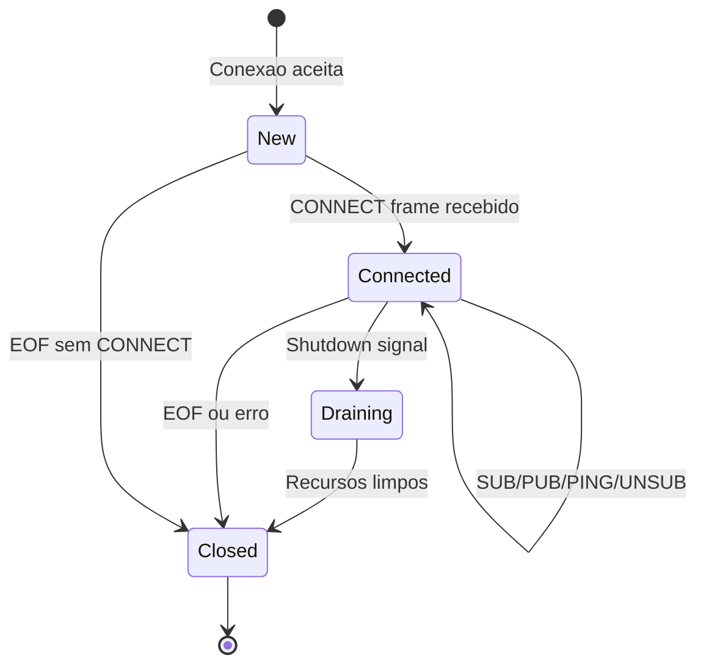
```mermaid
stateDiagram-v2
    [*] --> New: Conexao aceita
    New --> Connected: CONNECT frame recebido
    Connected --> Connected: SUB/PUB/PING/UNSUB
    Connected --> Draining: Shutdown signal
    Draining --> Closed: Recursos limpos
    Connected --> Closed: EOF ou erro
    New --> Closed: EOF sem CONNECT
    Closed --> [*]
```

---

## 8. Modelo de Entrega

### 8.1 Fanout

Para subscriptions sem queue group, a mensagem e entregue a **todos** os subscribers compativeis.

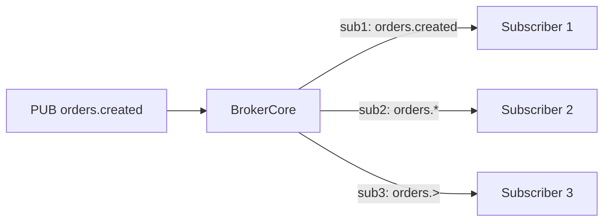
```mermaid
graph LR
    PUB["PUB orders.created"] --> B["BrokerCore"]
    B -->|"sub1: orders.created"| S1["Subscriber 1"]
    B -->|"sub2: orders.*"| S2["Subscriber 2"]
    B -->|"sub3: orders.>"| S3["Subscriber 3"]
```

### 8.2 Queue Group (Round-Robin)

Para subscriptions no mesmo queue group, **apenas um** membro recebe cada mensagem.

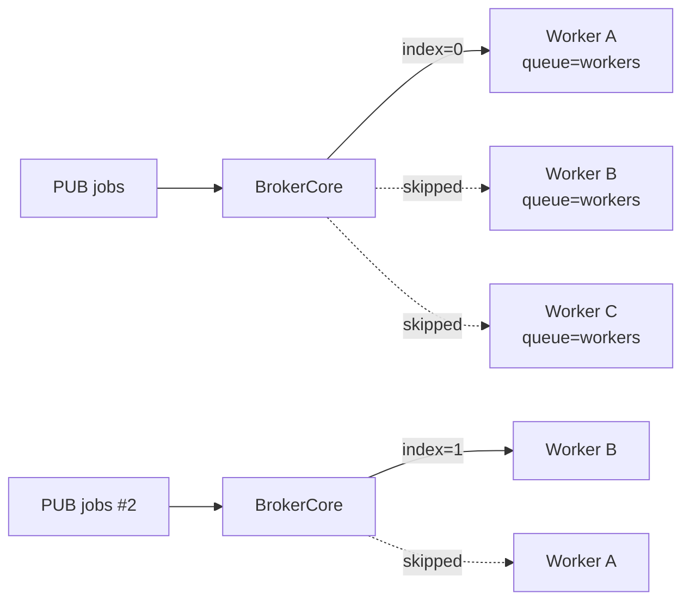
```mermaid
graph LR
    PUB["PUB jobs"] --> B["BrokerCore"]
    B -->|"index=0"| WA["Worker A<br/>queue=workers"]
    B -.->|"skipped"| WB["Worker B<br/>queue=workers"]
    B -.->|"skipped"| WC["Worker C<br/>queue=workers"]

    PUB2["PUB jobs #2"] --> B2["BrokerCore"]
    B2 -->|"index=1"| WB2["Worker B"]
    B2 -.->|"skipped"| WA2["Worker A"]
```

### 8.3 DeliveryHandle Trait

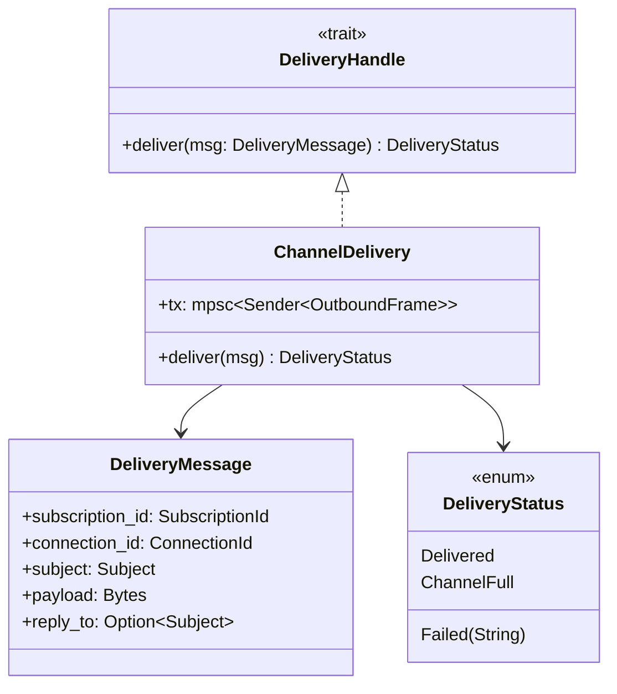
```mermaid
classDiagram
    class DeliveryHandle {
        <<trait>>
        +deliver(msg: DeliveryMessage) DeliveryStatus
    }

    class ChannelDelivery {
        +tx: mpsc~Sender~OutboundFrame~~
        +deliver(msg) DeliveryStatus
    }

    class DeliveryMessage {
        +subscription_id: SubscriptionId
        +connection_id: ConnectionId
        +subject: Subject
        +payload: Bytes
        +reply_to: Option~Subject~
    }

    class DeliveryStatus {
        <<enum>>
        Delivered
        ChannelFull
        Failed(String)
    }

    DeliveryHandle <|.. ChannelDelivery
    ChannelDelivery --> DeliveryMessage
    ChannelDelivery --> DeliveryStatus
```

---

## 9. Identificadores

Todos os IDs sao wrappers fortes em torno de `u64`, evitando troca acidental.

| Tipo | Struct | Geracao |
|------|--------|---------|
| ConnectionId | `ConnectionId(u64)` | AtomicU64 no accept loop |
| SubscriptionId | `SubscriptionId(u64)` | AtomicU64 no BrokerCore |
| MessageId | `MessageId(u64)` | AtomicU64 (futuro) |
| QueueGroupId | `QueueGroupId(u64)` | (futuro) |

---

## 10. Metricas

### 10.1 CoreMetrics

| Metrica | Tipo | Descricao |
|---------|------|-----------|
| `active_connections` | AtomicU64 | Conexoes TCP ativas |
| `total_connections` | AtomicU64 | Total historico de conexoes |
| `active_subscriptions` | AtomicU64 | Subscriptions ativas |
| `messages_published` | AtomicU64 | Total de PUB recebidos |
| `messages_delivered` | AtomicU64 | MSG entregues com sucesso |
| `messages_dropped` | AtomicU64 | MSG dropadas (canal cheio) |
| `protocol_errors` | AtomicU64 | Erros de decodificacao |

### 10.2 Log Periodico

O servidor loga um snapshot de metricas a cada 10 segundos:

```
INFO metrics_snapshot: active_connections=2 total_connections=2 active_subscriptions=5 messages_published=100000 messages_delivered=100000 messages_dropped=0 protocol_errors=0
```

---

## 11. Configuracao

### 11.1 ServerConfig

| Parametro | Default | Descricao |
|-----------|---------|-----------|
| `port` | 4222 | Porta TCP do servidor |
| `connection_output_buffer` | 65536 | Capacidade do canal de saida por conexao |
| `max_frame_size` | 2097152 (2MB) | Tamanho maximo de frame |

### 11.2 Release Profile

```toml
[profile.release]
lto = "fat"
codegen-units = 1
panic = "abort"
strip = true
```

---

## 12. Estrutura de Crates

### 12.1 `zetmq-core`

Logica de dominio do broker. Sem dependencia de TCP.

**Modulos:**
```
zetmq-core/src/
├── lib.rs              — Re-exports publicos
├── broker/
│   └── core.rs         — BrokerCore (subscribe, publish, unsubscribe)
├── delivery.rs         — DeliveryHandle trait, DeliveryMessage, DeliveryStatus
├── error.rs            — CoreError
├── id.rs               — ConnectionId, SubscriptionId, MessageId, IdGenerator
├── message.rs          — Message struct (Subject + Bytes + reply_to)
├── metrics.rs          — CoreMetrics (AtomicU64), MetricsSnapshot
├── queue_group.rs      — QueueGroupName wrapper
├── routing/
│   ├── mod.rs          — Re-exports
│   ├── engine.rs       — RoutingEngine (exact + wildcard)
│   └── trie.rs         — SubjectTrie (recursive match)
├── subject.rs          — Subject (Arc<str> + Arc<[String]>)
├── subject_pattern.rs  — SubjectPattern (PatternToken enum)
└── subscription/
    ├── mod.rs          — Subscription struct
    └── registry.rs     — SubscriptionRegistry (DashMap)
```

### 12.2 `zetmq-protocol`

Codec binario de frames. Sem dependencia do broker.

**Modulos:**
```
zetmq-protocol/src/
├── lib.rs              — Re-exports publicos
├── command/
│   ├── mod.rs          — BrokerCommand enum, from_frame()
│   ├── connect.rs      — ConnectCommand
│   ├── ping.rs         — PingCommand
│   ├── publish.rs      — PublishCommand
│   ├── subscribe.rs    — SubscribeCommand
│   └── unsubscribe.rs  — UnsubscribeCommand
├── error.rs            — ProtocolError
├── frame/
│   ├── mod.rs          — Frame struct, encode_into(), decode_from()
│   ├── frame_type.rs   — FrameType enum
│   └── header.rs       — FrameHeader (22 bytes), encode(), decode()
└── version.rs          — CURRENT_VERSION = 1
```

### 12.3 `zetmq-server`

Servidor TCP com sessoes.

**Modulos:**
```
zetmq-server/src/
├── main.rs             — Tokio runtime, signal handling, metrics loop
├── config.rs           — ServerConfig
├── error.rs            — ServerError
├── network/
│   ├── mod.rs          — Re-exports
│   └── listener.rs     — TcpListener accept loop
├── runtime/
│   ├── mod.rs          — Re-exports
│   └── dispatcher.rs   — dispatch() — route commands to BrokerCore
└── session/
    ├── mod.rs          — Re-exports
    ├── handler.rs      — handle_connection(), OutboundFrame, ChannelDelivery
    └── state.rs        — SessionState enum
```

---

## 13. Fluxo de Dados Completo — Publish to Delivery

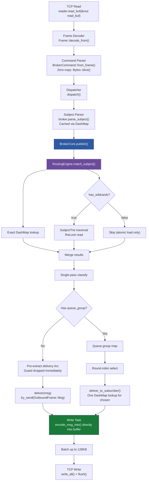
```mermaid
flowchart TD
    TCP_IN["TCP Read<br/>reader.read_buf(&mut read_buf)"] --> DECODE["Frame Decoder<br/>Frame::decode_from()"]
    DECODE --> CMD["Command Parser<br/>BrokerCommand::from_frame()<br/>Zero-copy: Bytes::slice()"]
    CMD --> DISP["Dispatcher<br/>dispatch()"]
    DISP --> PARSE["Subject Parser<br/>broker.parse_subject()<br/>Cached via DashMap"]
    PARSE --> PUB["BrokerCore.publish()"]

    PUB --> ROUTE["RoutingEngine.match_subject()"]
    ROUTE --> EXACT["Exact DashMap lookup"]
    ROUTE --> WC{"has_wildcards?"}
    WC -->|"true"| TRIE["SubjectTrie traversal<br/>RwLock read"]
    WC -->|"false"| SKIP["Skip (atomic load only)"]

    EXACT --> MERGE["Merge results"]
    TRIE --> MERGE
    SKIP --> MERGE

    MERGE --> CLASSIFY["Single-pass classify"]
    CLASSIFY --> FANOUT{"Has queue_group?"}

    FANOUT -->|"No"| EXTRACT["Pre-extract delivery Arc<br/>Guard dropped immediately"]
    FANOUT -->|"Yes"| QG_MAP["Queue group map"]

    EXTRACT --> DELIVER_FAN["deliver(msg)<br/>try_send(OutboundFrame::Msg)"]
    QG_MAP --> RR["Round-robin select"]
    RR --> DELIVER_QG["deliver_to_subscriber()<br/>One DashMap lookup for chosen"]

    DELIVER_FAN --> WRITE["Write Task<br/>encode_msg_into() directly into buffer"]
    DELIVER_QG --> WRITE
    WRITE --> BATCH["Batch up to 128KB"]
    BATCH --> TCP_OUT["TCP Write<br/>write_all() + flush()"]

    style PUB fill:#2d5aa0,color:#fff
    style ROUTE fill:#6b4c9a,color:#fff
    style WRITE fill:#1a7a3a,color:#fff
```

---

## 14. Otimizacoes Implementadas

| Otimizacao | Descricao | Impacto |
|------------|-----------|---------|
| Zero-copy payload | `Bytes::slice()` em vez de `copy_from_slice()` | -1 heap alloc + -1 memcpy por PUB |
| Zero-copy subject | Subject como `Bytes` slice do frame | -1 String alloc por PUB |
| Subject cache | DashMap cache de subjects parseados | Elimina Arc allocs para subjects repetidos |
| Wildcard fast-path | AtomicBool pula RwLock quando nao ha wildcards | Evita lock contention |
| Vec pre-alocado | `Vec::with_capacity(8)` em match_subject | -1-2 heap allocs |
| Subscription merge | Unico DashMap em vez de dois | -1 DashMap lookup |
| Single-pass publish | Pre-extrai delivery Arcs na classificacao | Elimina segunda lookup no fanout |
| OutboundFrame lazy | MSG codificado direto no write buffer | Evita BytesMut intermediario |
| BufWriter removido | Encode buffer ja faz batching | -1 copia layer redundante |
| Direct read | `read_buf()` direto no BytesMut | Evita memcpy de 65KB do stack |
| Guard drop | DashMap guard dropado antes do channel send | Reduz lock hold time ~50% |
| SUBACK pre-alloc | `BytesMut::with_capacity(8)` | Evita realloc |

---

## 15. Decisoes Arquiteturais (ADRs)

### ADR-001: Protocolo binario proprio
**Decisao:** Frame header fixo de 22 bytes com magic number `0x5A4D`.
**Justificativa:** Overhead minimo, parsing O(1), versionamento nativo, suporte a payload binario sem escaping.

### ADR-002: Core independente de transporte
**Decisao:** `zetmq-core` usa trait `DeliveryHandle` em vez de `TcpStream`.
**Justificativa:** Testabilidade (unit tests com FakeDelivery), futuro suporte a QUIC/Unix sockets.

### ADR-003: DashMap para estado compartilhado
**Decisao:** Usar DashMap em vez de `RwLock<HashMap>` para subscriptions.
**Justificativa:** Sharding interno reduz contention sob alto concurrency. Lock-free reads.

### ADR-004: RwLock para SubjectTrie
**Decisao:** Trie protegida por RwLock, com AtomicBool fast-path.
**Justificativa:** Wildcards sao menos frequentes que exact matches. O fast-path evita adquirir o lock na maioria dos publishes.

### ADR-005: Bytes para payload
**Decisao:** `bytes::Bytes` para payload e subject no protocolo.
**Justificativa:** `Bytes::slice()` e zero-copy. `Bytes::clone()` e apenas Arc increment. Fanout de N subscribers compartilha o mesmo payload.

### ADR-006: Politica de slow consumer = drop + channel full
**Decisao:** `try_send()` retorna `ChannelFull`, mensagem e dropada.
**Justificativa:** Protege o broker de acumulacao de memoria. Simples e deterministico.

---

## 16. Build e Testes

### Build
```bash
cargo build --workspace
cargo build --release -p zetmq-server
```

### Testes unitarios
```bash
cargo test --workspace
cargo test --release -p zetmq-core
cargo test --release -p zetmq-protocol
```

### Testes de integracao
```bash
cargo test --release -p zetmq-tests --test pubsub_integration
cargo test --release -p zetmq-tests --test wildcard_integration
cargo test --release -p zetmq-tests --test backpressure_integration
cargo test --release -p zetmq-tests --test disconnect_integration
```

### Benchmarks (WSL)
```bash
wsl bash -c "source ~/.cargo/env && cd /mnt/d/TI/git/ZetMQ && cargo test --release -p zetmq-tests --test throughput_benchmark -- --test-threads=1 --nocapture"
wsl bash -c "source ~/.cargo/env && cd /mnt/d/TI/git/ZetMQ && cargo test --release -p zetmq-tests --test throughput_multi -- --test-threads=1 --nocapture"
```

### Lint
```bash
cargo fmt --check --all
cargo clippy --workspace -- -D warnings
```
